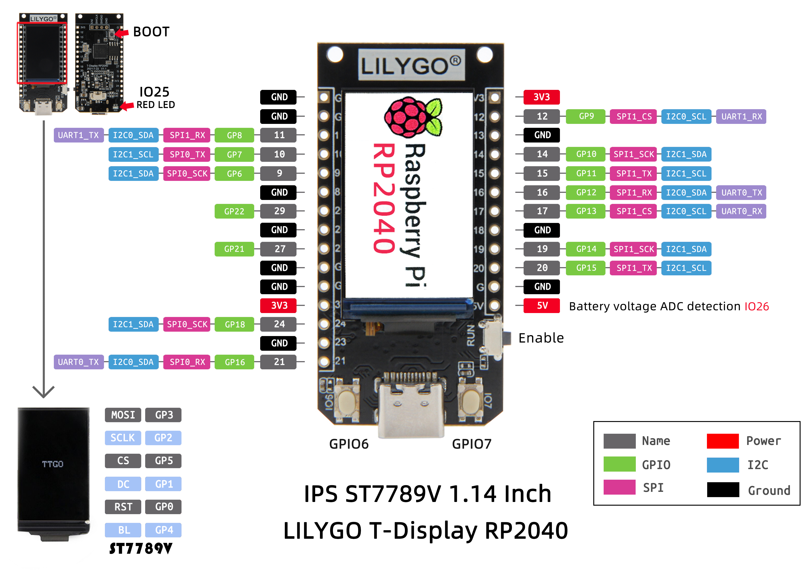
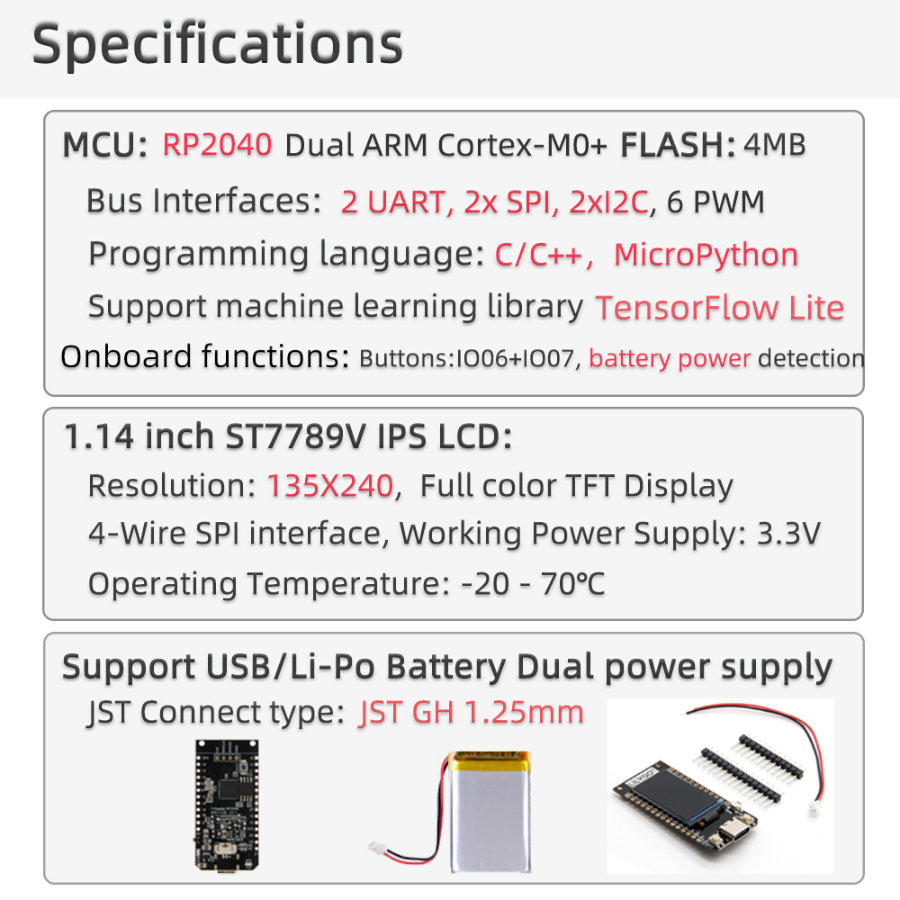

<h1 align = "center"> 🌟LilyGO T-Display RP2040🌟</h1>





# Quick start:

## Arduino

>1. Open up the **Arduino IDE** and go to File->Preferences.
>2. In the dialog that pops up, enter the following URL in the "Additional Boards Manager URLs" field:
>```
>https://github.com/earlephilhower/arduino-pico/releases/download/global/package_rp2040_index.json
>```
> 3. Go to Tools->Boards->Board Manager in the IDE
> 4. Type "pico" in the search box and select "Add":
> 5. Copy **TFT_eSPI** from the **https://github.com/Bodmer/TFT_eSPI** repository, copy the **TFT_eSPI.master** directory in the  **<C:\Users\Your User Name\Documents\Arduino\libraries>** directory and rename it into **TFT_eSPI**
> 6. In the **<C:\Users\Your User Name\Documents\Arduino\libraries\TFT_eSPI>** folder, edit **User_Setup_Select.h** and uncomment the following line:
> ```c
> #include <User_Setups/Setup137_LilyGo_TDisplay_RP2040.h>
> ```
> 7. In the **<C:\Users\Your User Name\Documents\Arduino\libraries\TFT_eSPI>** folder, edit **User_Setup.h** and comment out the following line:
> ```c
> //#define ILI9341_DRIVER       // Generic driver for common displays
> ```
> 8. In the same file, comment out all lines defining pins (TFT_CS, TFT_DC, ...); this step is optional but will avoid compilation warnings  
> 9. Copy the **firmware** folder from this repository in **<C:\Users\Your User Name\Documents\Arduino>**
> 10. Open **Arduino IDE**, and open the **firmware** sketch
> 11. Plug your LilyGO T-Display RP2040 into your computer
> 12. In the **Arduino IDE** tool options, select the development board  **Raspberry Pi Pico**, and the port corresponding the LilyGO T-Display RP2040. Other keep the default
> 13. Click to the "Upload" button (right arrow) on the **Arduino IDE**. The sketch should compile, and be sent to the LilyGO T-Display RP2040 (note there are a few seconds between the end of compilation and the actual uploading. Just wait)


**Remarks:**
* You can also use other sample programs provided by TFT_eSPI with some minor changes (mostly changing the screen size and switching the backlight on with something like the following line)
```c
analogWrite(4, 255); // pin 4 controls the backlight; values between 0 (off) and 255 (full brightness) are accepted
```
* The **Raspberry Pi Pico** board accepts a maximum of 2MB of flash. You may use **Generic RP2040** instead if you want to use the whole 4MB of flash installed on the LilyGO T-Display RP2040
* If you brick your LilyGO T-Display RP2040 (if it is no longuer showing up in port menu in Arduino IDE) you may do the following steps:
  *   Hold down the BOOT button, click the reset button, and release the BOOT button after a delay of one second or after waiting for the computer to eject a new disk
  *   A new USB drive with a size of 127MB should appear in your computer disks. Copy the **firmware.uf2** file from this repository on the new disk
  *   After a few seconds, the drive should disapear and your LilyGO T-Display RP2040 should be back to factory state
* You can use the above method to install any other arduino Sketch if you have compiled it as an uf2 file
* If the Arduino IDE stays stuck after compilation and does not upload your sketch, try pressing Boot + Reset

## MicroPython

>1. install [Thonny Python IDE](https://github.com/thonny/thonny/releases/download/v3.3.5/thonny-3.3.5.exe)
>2. After the installation is complete, you need to click on the toolbar, click Run -> Select Interpreter, enter the following interface, select **Raspberry Pi Pico**, you need to configure Pico before configuring the following ports
>3. Press the **BOOT** button, click **RES**, then go back to Thonny Python IDE and change the port to the serial port where Pico is located. If you don't find it, click **Install or update firmware**.
>4. Enter or save as a script to run
```
from machine import Pin, Timer
led = Pin(25,Pin.OUT)
tim = Timer()
def tick(timer):
    global led
    led.toggle()
tim.init(freq=2.5, mode=Timer.PERIODIC, callback=tick)
```
>5. If you need to save to the chip, you need to click **File->Save As->rp2040**.

>6. For more usage methods, please refer to the Micro python [documentation](http://docs.micropython.org/).
<br><br>
## Raspberry Pi Pico SDK
### The following content is from the introduction of [Raspberry Pi Pico SDK](https://github.com/raspberrypi/pico-sdk).

>These instructions are extremely terse, and Linux-based only. For detailed steps, instructions for other platforms, and just in general, we recommend you see [Raspberry Pi Pico C/C++ SDK](https://rptl.io/pico-c-sdk).
>1. Install CMake (at least version 3.13), and GCC cross compiler
 >> ```
 >> sudo apt install cmake gcc-arm-none-eabi libnewlib-arm-none-eabi libstdc++-arm-none-eabi-newlib
 >> ```
>2. Set up your project to point to use the Raspberry Pi Pico SDK
>
>  * Either by cloning the SDK locally (most common) :
>     1. `git clone` this Raspberry Pi Pico SDK repository
>     1. Copy [pico_sdk_import.cmake](https://github.com/raspberrypi/pico-sdk/blob/master/external/pico_sdk_import.cmake)
>        from the SDK into your project directory
>     2. Set `PICO_SDK_PATH` to the SDK location in your environment, or pass it (`-DPICO_SDK_PATH=`) to cmake later.
>     3. Setup a `CMakeLists.txt` like:
>
>         ```cmake
>         cmake_minimum_required(VERSION 3.13)
>
>         # initialize the SDK based on PICO_SDK_PATH
>         # note: this must happen before project()
>         include(pico_sdk_import.cmake)
>
>         project(my_project)
>
>         # initialize the Raspberry Pi Pico SDK
>         pico_sdk_init()
>
>         # rest of your project
>
>         ```
>
>  * Or with the Raspberry Pi Pico SDK as a submodule :
>     1. Clone the SDK as a submodule called `pico-sdk`
>     1. Setup a `CMakeLists.txt` like:
>
>         ```cmake
>         cmake_minimum_required(VERSION 3.13)
>
>         # initialize pico-sdk from submodule
>         # note: this must happen before project()
>         include(pico-sdk/pico_sdk_init.cmake)
>
>         project(my_project)
>
>         # initialize the Raspberry Pi Pico SDK
>         pico_sdk_init()
>
>         # rest of your project
>
>         ```
>
>  * Or with automatic download from GitHub :
>     1. Copy [pico_sdk_import.cmake](https://github.com/raspberrypi/pico-sdk/blob/master/external/pico_sdk_import.cmake)
>        from the SDK into your project directory
>     1. Setup a `CMakeLists.txt` like:
>
>         ```cmake
>         cmake_minimum_required(VERSION 3.13)
>
>         # initialize pico-sdk from GIT
>         # (note this can come from environment, CMake cache etc)
>         set(PICO_SDK_FETCH_FROM_GIT on)
>
>          # pico_sdk_import.cmake is a single file copied from this SDK
>          # note: this must happen before project()
>          include(pico_sdk_import.cmake)
>
>          project(my_project)
>
>          # initialize the Raspberry Pi Pico SDK
>          pico_sdk_init()
>
>          # rest of your project
>
>          ```
> 3. Write your code (see [pico-examples](https://github.com/raspberrypi/pico-examples) or the [Raspberry Pi Pico C/C++ SDK](https://rptl.io/pico-c-sdk) documentation for more information)
>
>   About the simplest you can do is a single source file (e.g. hello_world.c)
>>
> >  ```c
> >  #include <stdio.h>
> >  #include "pico/stdlib.h"
>>
> >  int main() {
> >      setup_default_uart();
> >      printf("Hello, world!\n");
> >      return 0;
> >  }
> >  ```
>   And add the following to your `CMakeLists.txt`:
>
>  > ```cmake
>  > add_executable(hello_world
>  >     hello_world.c
>  > )
>>
>  > # Add pico_stdlib library which aggregates commonly used features
>  > target_link_libraries(hello_world pico_stdlib)
>>
>  > # create map/bin/hex/uf2 file in addition to ELF.
>  > pico_add_extra_outputs(hello_world)
>  > ```
>
>   Note this example uses the default UART for _stdout_;
>   if you want to use the default USB see the [hello-usb](https://github.com/>raspberrypi/pico-examples/tree/master/hello_world/usb) example.
>
>
>1. Setup a CMake build directory.
>      For example, if not using an IDE:
>   >   ```
>   >   $ mkdir build
>   >   $ cd build
>   >   $ cmake ..
>   >   ```
>
>1. M>ake your target from the build directory you created.
>    >  ```sh
>    >  $ make hello_world
>    >  ```
>
>1. You now have `hello_world.elf` to load via a debugger, or `hello_world.uf2` that >can be installed and run on your Raspberry Pi Pico via drag and drop.


<h3 align = "left">Product 📷:</h3>

|  Product   |                                                                                                Product  Link                                                                                                 |
| :--------: | :----------------------------------------------------------------------------------------------------------------------------------------------------------------------------------------------------------: |
| T-Display RP2040 |   [AliExpress](https://www.aliexpress.com/item/1005003281043979.html)   |


| Pins       | RP2040          |
| ---------- | --------------- |
| TFT Driver | ST7789(240*135) |
| TFT_MISO   | N/A             |
| TFT_MOSI   | 3               |
| TFT_SCLK   | 2               |
| TFT_CS     | 5               |
| TFT_DC     | 1               |
| TFT_RST    | 0               |
| TFT_BL     | 4               |
| PWR_ON     | 22              |
| BOTTON1    | 6               |
| BOTTON2    | 7               |
| RedLED     | 25              |
